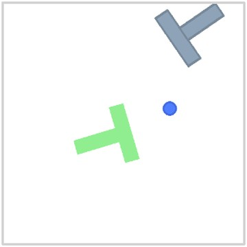
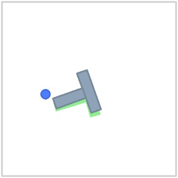

<h1 align="center">Aim Short to Reach Far</h1>

<p align="center"><strong>Your Frozen World Model Can Plan Better Than You Think</strong></p>

<p align="center">
  Xvyuan Liu, Jianjie Fang, Chen Gao, Yong Li<br>
  Tsinghua University
</p>

<p align="center">
  <a href="https://daybraeklaxry.github.io/Aim-Short-to-Reach-Far/"><strong>Project Page</strong></a>
  &emsp.
  <a href="https://arxiv.org/abs/2609.30036"><strong>arXiv</strong></a>
  &emsp.
  <a href="https://arxiv.org/pdf/2609.30036"><strong>PDF</strong></a>
  &emsp.
  <a href="https://daybraeklaxry.github.io/Aim-Short-to-Reach-Far/#demos"><strong>Demos</strong></a>
  &emsp.
  <a href="REPRODUCING.md"><strong>Code &amp. Data Guide</strong></a>
</p>

<p align="center">
  <a href="https://daybraeklaxry.github.io/Aim-Short-to-Reach-Far/">
    
  </a>
</p>

**A frozen world model can support better control when the planning target changes.** Reaching a distant goal may require first moving away from it. Anchored Planning retrieves a recorded observation as an intermediate target, then uses the frozen model to evaluate actions from the current state. The same target supports **AP-CEM**, which synthesizes actions, and **AP-rank**, which selects among recorded action blocks.

## Demos

<table>
  <tr>
    <th align="center">AP-rank: select actions</th>
    <th align="center">AP-CEM: synthesize actions</th>
  </tr>
  <tr>
    <td width="50%" align="center">
      <a href="https://daybraeklaxry.github.io/Aim-Short-to-Reach-Far/#ap-rank">
        
        
      </a>
    </td>
    <td width="50%" align="center">
      <a href="https://daybraeklaxry.github.io/Aim-Short-to-Reach-Far/assets/demos/pusht-000.mp4">
        
      </a>
    </td>
  </tr>
  <tr>
    <td align="center">Final-goal ranking and AP-rank from the same perturbed start.<br><a href="https://daybraeklaxry.github.io/Aim-Short-to-Reach-Far/#ap-rank">Watch AP-rank</a></td>
    <td align="center">Search toward an observed target with the same frozen model.<br><a href="https://daybraeklaxry.github.io/Aim-Short-to-Reach-Far/assets/demos/pusht-000.mp4">Watch AP-CEM</a></td>
  </tr>
</table>

These are selected successful cases from paired evaluations. [Explore all sixteen demos](https://daybraeklaxry.github.io/Aim-Short-to-Reach-Far/#demos) across Cube, PushT, Reacher, and TwoRoom, or see the [full evaluation results](https://daybraeklaxry.github.io/Aim-Short-to-Reach-Far/#results).

## Using the repository

- **[Code and setup](code/ap/README.md#external-assets):** controller implementation, pretrained models, datasets, and simulator dependencies.
- **[Reproduction guide](REPRODUCING.md):** recompute the paper's tables, run evaluations, and render paired demonstrations from saved states.
- **[Recorded results](data/README.md):** per-episode measurements, definitions, and units.
- **[LeWM evaluation](lewm_checks/README.md):** released-planner settings and comparisons with the released evaluator.

The [reproduction guide](REPRODUCING.md#code-and-data-layout) maps each experiment to its code and data.

## Citation

```bibtex
@misc{liu2026aimshort,
  title  = {Aim Short to Reach Far: Your Frozen World Model Can Plan Better Than You Think},
  author = {Xvyuan Liu and Jianjie Fang and Chen Gao and Yong Li},
  year   = {2026},
  eprint = {2609.30036},
  archivePrefix = {arXiv},
  primaryClass = {cs.LG},
  url    = {https://arxiv.org/abs/2609.30036}
}
```

## License

Original code is released under the [MIT License](LICENSE). Parts derived from LeWM retain their original license and notices in [`code/ap/LICENSE`](code/ap/LICENSE) and [`code/ap/NOTICE.md`](code/ap/NOTICE.md). External datasets, simulators, and checkpoints remain subject to their original terms and are not redistributed here.
